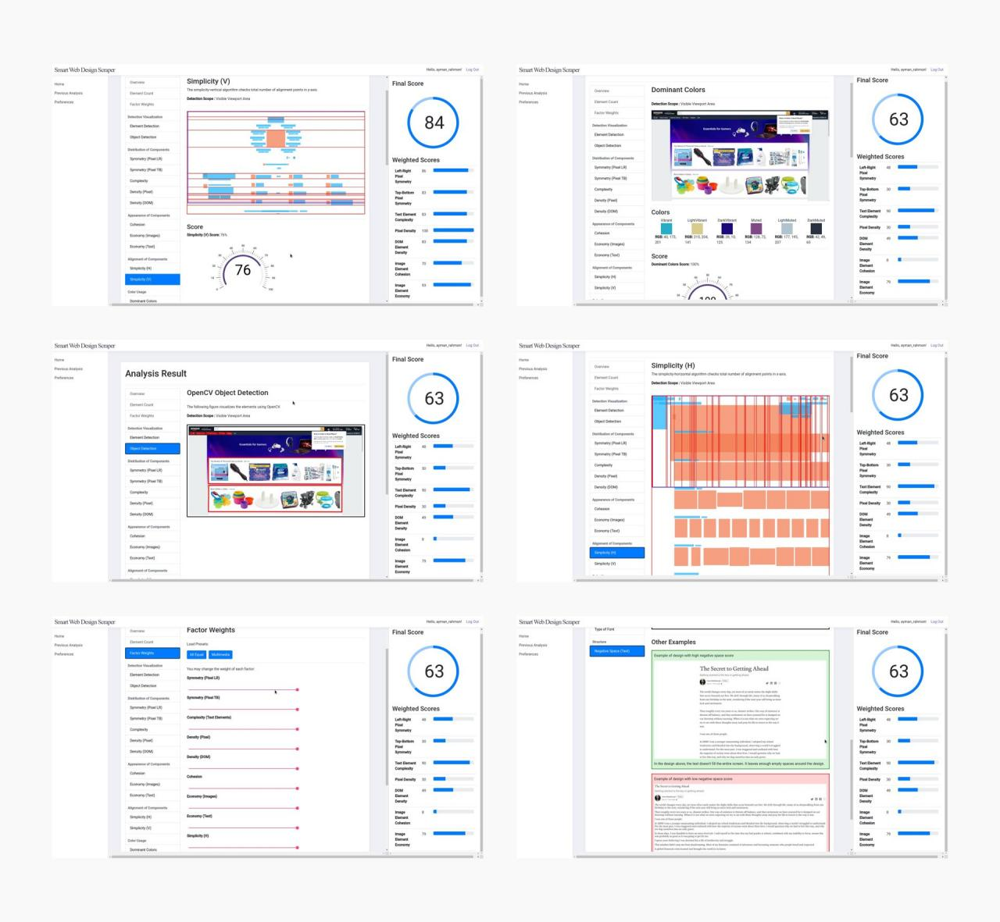

# Smart Web Design Scraper (Graduation Project)

The archived repo of "Smart Web Design Scraper" graduation project.




## Technologies

This project uses the following libraries

- Docker
- Angular
- Express
- OpenCV
- Java Spring
- Apollo GraphQL

## Preparation

These steps are required before development or production compilation.

```sh
# Install node modules
(cd shared && npm install)
(cd client && npm install)
(cd server && npm install)
(cd chrome-ext && npm install)
```

## Running development mode

### Terminal 1: Mongo & Spring
```
docker-compose -f dev.docker-compose.yml up --build
```

### Terminal 2: Express
```
cd server
npm start
```

### Terminal 3: Angular
```
cd client
npm start
```

### Terminal 4: Chrome Extension
```
cd chrome-ext
npm run watch
```

## Running the app

```sh
# Compile codes
(cd client && npm run build)
(cd server && npm run build)
(cd chrome-ext && npm run build)

# Run docker
docker-compose up
```

## Authors
- Ezzat Chamudi
- Mohammed Ayman Rahmon
